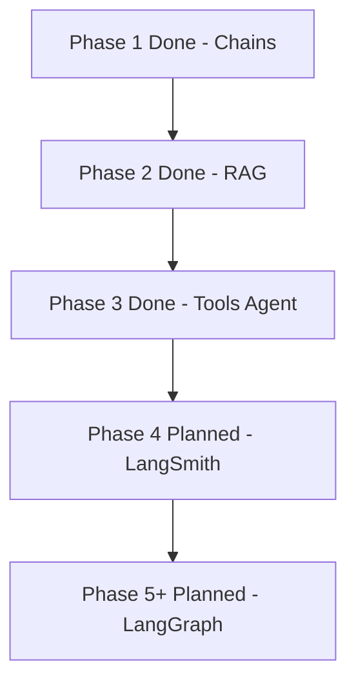
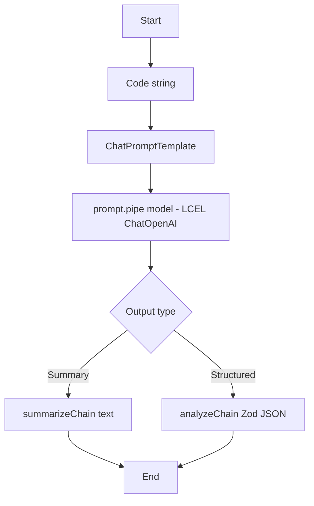
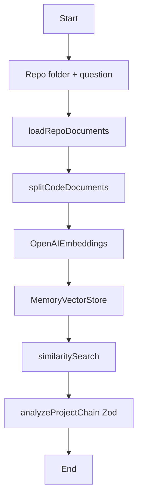
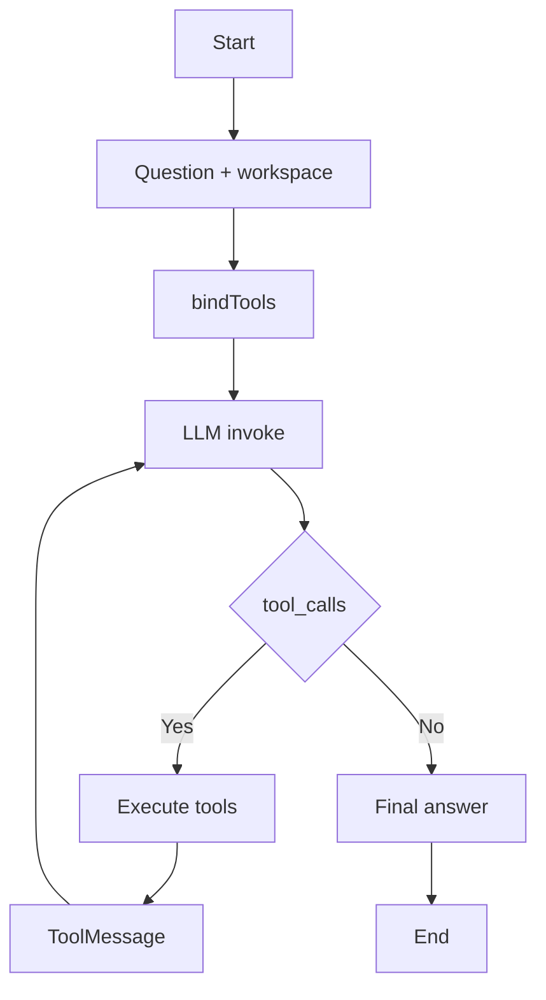

# AI Engineering Copilot

Mini Cursor-style coding agent built progressively with **LangChain**, **LangGraph**, and **LangSmith**.

| Resource | What it is |
|---|---|
| **[Tutorial blog](./docs/tutorial.md)** | Full fresher guide (read this start → end) |
| **[Phase notes](./docs/phases.md)** | Phase checklist |
| Local HTML | [`learning-flow.html`](./docs/learning-flow.html) · [`flow-diagram.html`](./docs/flow-diagram.html) (open in a browser; GitHub does not render HTML UIs) |

> **Note:** The diagrams below use **Mermaid**, which GitHub renders on this README after you push.

---

## Progress



---

## Learning path (quick)

| Idea | Meaning | Phase |
|---|---|---|
| **Chat model** | Wrapper around an LLM API (`ChatOpenAI`) | 1 |
| **Prompt template** | System + human messages with variables like `{code}` | 1 |
| **LCEL** | Compose steps with `prompt.pipe(model)` | 1 |
| **Structured output** | Force JSON via Zod + `withStructuredOutput` | 1 |
| **Document** | File text + metadata (`source` path) | 2 |
| **Chunk / embed / vector store** | Split text → vectors → searchable index | 2 |
| **RAG** | Retrieve relevant chunks, then ask the LLM | 2 |
| **Tool** | Function the model can call (`read_file`, …) | 3 |
| **Agent loop** | LLM → tool_calls → ToolMessage → LLM → … | 3 |

**Ladder:** you provide context (P1) → retrieval provides context (P2) → model fetches context with tools (P3).

Full explanations: **[docs/tutorial.md](./docs/tutorial.md)**

---

## Flow diagrams

### Phase 1 — Snippet analyzer (LCEL chain)



**Run:** `npm run phase1`  
**Code:** `packages/agent/src/chains/*`, `prompts/*`, `schemas/analysis.schema.ts`

---

### Phase 2 — Project analyzer (RAG)



**Run:** `npm run phase2`  
**Code:** `packages/agent/src/rag/*`, `project/analyze-project.ts`  
**Fixture:** `workspace/fixtures/slow-users-endpoint`

---

### Phase 3 — Tools + agent loop



**Tools:** `list_files` · `read_file` · `search_code` · `run_tests` · `run_linter` · `git_diff` · `git_log`  
**Run:** `npm run phase3`  
**Code:** `packages/agent/src/tools/*`, `agent/run-coding-agent.ts`

---

## Monorepo layout

```text
apps/
  api/          NestJS product API (auth, sessions, HITL, queues)
  web/          Next.js UI
packages/
  agent/        LangGraph-native agent core (Studio-compatible)
  shared/       Shared types / DTOs
  config/       Centralized env (`ENV` from `@aec/config`)
  evals/        LangSmith evaluation datasets & experiments
workspace/      Sandboxed repos the agent analyzes
infra/          Docker / AWS
```

## Getting started

```bash
npm install
cp .env.example .env
# set OPENAI_API_KEY in .env

npm run phase1
npm run phase2
npm run phase3
```

Custom Phase 2 / 3 (paths resolve from repo root):

```bash
npm run phase2 -- ./workspace/fixtures/slow-users-endpoint "Why is /users slow?"
npm run phase3 -- ./workspace/fixtures/slow-users-endpoint "Why is /users slow?"
```

## Scripts

| Command | Description |
|---|---|
| `npm run phase1` | Phase 1 snippet analyzer demo |
| `npm run phase2` | Phase 2 project analyzer demo |
| `npm run phase3` | Phase 3 tools agent demo |
| `npm run dev:api` | NestJS API |
| `npm run dev:web` | Next.js UI |
| `npm run dev:agent` | LangGraph Studio / `langgraph dev` |
| `npm run build` | Build all workspaces |

## Design rule

`packages/agent` stays **plain TypeScript** (no Nest decorators).  
`apps/api` imports and invokes the exported graph only.

## Maintain diagrams

When a new phase ships:

1. Add a Mermaid section to this **README** (so GitHub shows it).  
2. Update [`docs/tutorial.md`](./docs/tutorial.md).  
3. Update local HTML under `docs/` if you still use them in the browser.
